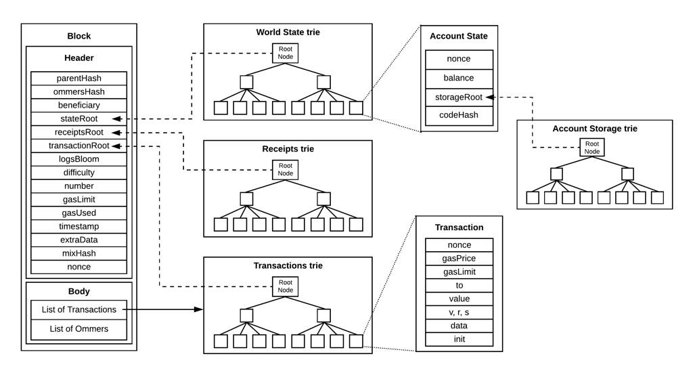
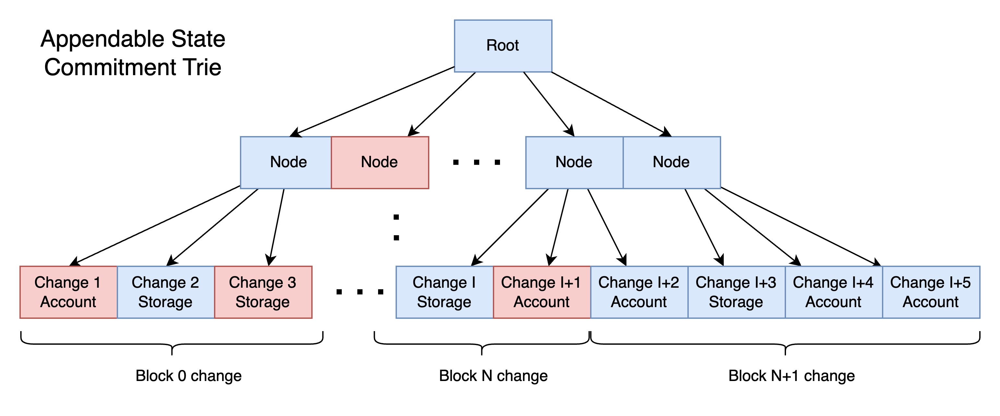

+++
title = "Appendable State Commitment"
description = "Research overview on State commitments and introduction to Appendable State Commitment."
date = 2024-07-29T12:00:00+00:00
updated = 2024-07-29T12:00:00+00:00
draft = false
template = "blog/page.html"

[taxonomies]
authors = ["draganrakita"]
+++

The current Ethereum State Commitment is in a form of a Merkle Trie over the accounts. Key of that trie is account address, and the value is a hash of account information (balance, nonce, code hash, and storage root).

To be precise, it is a double-layered Merkle trie where the second layer is contract storage, and its root is included in the account information. This structure is planned to be changed with the Verkle trie transition, where only one layer containing both account and storage will be present, a promising path forward.

In the diagram, we see a stateRoot that is the root hash of the World State Trie, which contains account information and an additional layer of storage trie.

This random trie structure takes time to update and is the main bottleneck in block execution at the chain's tip. It takes around 80% of the time to execute a block, calculate the state root, and commit data to the database. The most common way to address this performance penalty is to store trie changes in memory, calculate/verify the needed state root, and flush changes later in the background.

When I approached this issue, I wanted to explore and design a different state commitment that would have similar features but be appendable, as appending data is much faster to reason and insert to the disk. And would open a path to increased throughput.

Note: If you are familiar with the present setup, skip to the main explanation [here](#Appendable-state-commitment).

## Why do we need State commitment (SC)?

This is a good topic to discuss, as it introduces a core mechanism and tradeoffs between protocols.

Blockchain can "function" without any state commitment, as ultimately, consensus that chooses the next block is what matters. However, without it, you risk the security of the blockchain and put pressure on ensuring the code is correctly executed (for Ethereum, this involves multiple clients or even multiple versions of the same client).

State commitment allows (among other things) stricter control over changes, eliminates bugs, and prevents "bad" states.

## Output state commitment

Bitcoin is a good example of simple state commitment, using UTXO (unspent transaction output). Blocks consume UTXO and generate new UTXO (the difference in state is a commitment).

If Ethereum implemented a similar protocol, it would make a state commitment on accounts that have changed.

This approach is very fast as we calculate the state root on data fully in memory. That data is then appended to the database, with no insertions.

The problem is that to get to the newest state, Bitcoin needs to download all blocks to construct that state. For Ethereum, which has much more data, this would be unusable, as verification of that state is not possible with data from the block header.

Therefore, we need a commitment that will encompass the full state.

## Full state commitment

The current Ethereum approach solves those shortcomings by having a trie over the full state. This offers many benefits. It enables downloading and verifying snapshots of the state and allows witnesses (proof of values) on data to be made.

The problem with full state commitment is its slowness; random insertion or removal of nodes necessitates disk read/writes, creating a bottleneck in execution.

There's an additional penalty of storing the trie in off-the-shelf KV databases, so custom databases that leverage the Merkle Trie structure (Paprika) are being researched and developed.

One additional optimization approach all Ethereum clients use is to have a plain state and a trie separate. When executing blocks, state reads use the plain state, while writes touch the trie and are done in bulk (it's more efficient to do this in bulk).

An additional idea is to delay state root calculation to the next block, allowing more time for its construction. There will always be a time delay between blocks as consensus voting needs to happen; it's efficient to use that time to construct the state root.

Expanding on delayed state root we could even calculate full state commitment every N blocks where immediate blocks would calculate Output State Commitment (Or none if chosen). But that comes with its own pros/cons.

## Appendable state commitment

This solution eliminates random insertion by appending all changes to one trie and modifying (invalidating) existing keys. The trie key is the index of the change, and the value is new account information or storage value.

Every block change (write set) is appended to the trie, as all data goes to the end of the trie, making insertion faster. Additionally, past values need invalidation to ensure only one account value is found inside the ASC Trie.

As insertions are linear, they can be stored in simple binary files, making the index a simple integer number and eliminating the need for a database. Accessing past values for invalidation becomes a read from a binary file, as all changes are indexed.

To index this data, plain accounts and storage must contain the last trie index when they were changed. This index directly indicates which binary file needs modification.

Invalidating changes can be viewed as removing values from the trie or setting them to a predefined NULL value. The problem with invalidating changes inside binary files is disk defragmentation, which can be run periodically.

Counter-intuitively, we update two leaves (values) per change with this method, compared to once in Full SC. However, the data access method differs, making ASC faster. For example, in Reth, random inserts of the txlookup table were very slow, but writing all changes to files first and then reading them in an ordered way for database insertion resulted in 10x faster insertion, [reth PR](https://github.com/paradigmxyz/reth/issues/6909).

Appendable SC Trie looks something like:

Invalidated nodes/data are in red, while valid data still present is in blue. Changesets are already present in Reth (although in a different format) and used to fetch historical state.

The depth and width of the trie can be discussed. It could even be a Verkle trie with 256 branches and 4 levels of depth.

As the trie grows larger and old changes are invalidated, old data will become fragmented. There is a need to implement a fragmentation process for invalidated nodes.

## Witness support for Appendable SC.

To support witnesses and maintain the same functionality as in full state commitment, we need proof that data is not part of the state. This is not possible with only an Appendable SC, so an additional structure needs to be added to mark data as included (Included Trie). This structure will have a similar structure to the present Ethereum trie, where values are not needed, but we care only if the key is present.

## Final design

For this to work, we will need three components:

1. Plain state that contains account info, storage, and index where the last change happened.
2. Appendable SC Trie: a state commitment over all changes.
3. Witness support with Included Trie: state commitment on all accounts/storage that changed.

## Flow of updates:

When an account is created with a balance increment:
1. The plain state is inserted.
2. The change is appended to the Appendable SC Trie.
2. The address is inserted into the Included Trie to mark the account as included.

This process of inserting an account is similar to the present state.

When an account is updated:

1. The plain state is updated.
2. Changes are appended to the Appendable SC Trie.
3. The old change is invalidated in the Appendable SC Trie.

This process is faster as both appending data and invalidating are quicker than randomly inserting in the Trie.

## Conclusion

In the end this a new concept that is not a silver bulet and has its own pross and cons.

Pros:

* Appendable SC removes overhead of LSM/Binary trie database. Makes binary format easier to use.
* Append of data to binary files are a lot faster that random inserts.
* Removal/invalidation is faster in binary form that removal in database.

Cons:

* It is faster on data that was previously changed, not on new data insert.
* Appendable Trie gets fragmented. Defragmentation algo needs to be run.
* Requires new Included trie, that takes more disk space.

Idea for this post is to inspire a potentially new research topic, breaks the mold of what we think about state commitment and to reiterate why we need state commitment and why is it in this current format.

