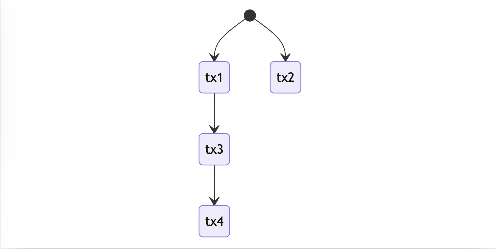
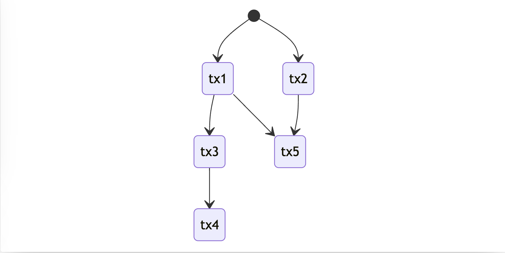
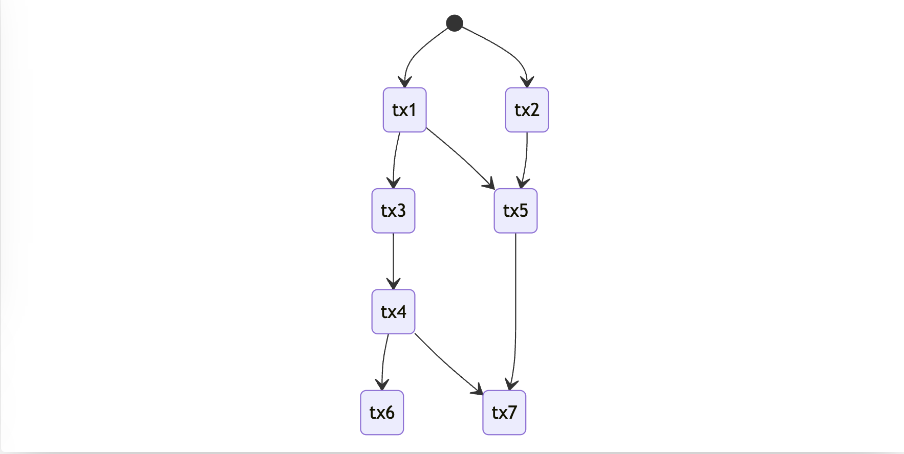

+++
title = "Parallel EVM claim"
description = "How to verify claim of parallel execution"
date = 2023-07-09T22:20:00+00:00
updated = 2023-07-09T22:20:00+00:00
draft = false
template = "blog/page.html"

[taxonomies]
authors = ["draganrakita"]
+++

This paper is not what you would expect, it is not about how to find the order and dependencies of transaction execution, as there are already a few approaches to this, first can be done with access lists (UTXO, Solana) and the main paper for the second approach is to brute force it with probabilistic execution aka [Block-STM](https://arxiv.org/abs/2203.06871) pioneered by Nova/Aptos, and some EVM type blockchain emulated this and gained good performance boost ([Polygon PoS](https://polygon.technology/blog/innovating-the-main-chain-a-polygon-pos-study-in-parallelization), [Binance Chain](https://www.bnbchain.org/tr/blog/new-milestone-the-implementation-of-parallel-evm-2-0/) both got similar performance).

The idea is for the builder to (somehow) find the transactions that can be done in parallel (the great thing about this is that this can be considered as a black box and can evolve on its own) and share that claim in a form of the transaction [DAG](https://en.wikipedia.org/wiki/Directed_acyclic_graph) to other peers/validators, the builder will be rewarded for doing that correctly. And verifier needs to execute those transactions in parallel following that DAG and **verify** the integrity of that claim. We will talk about how to verify this claim (Split of builder and verifier in imho is a very powerful idea that is a little bit undervalued allows us cleaner system modelling).

Until now I didn't find anything related to this and the topic seems a lot more interesting to explore. You don't need to increase your transaction size with an access list and you don't need to do expensive probabilistic execution (at least not for a lot of nodes), so verifiers have smaller work that they need to do but still fully consistently verify execution. And there is an additional benefit for archive sync that I will talk about later.

Parallel claim verification creates a potential path to introduce parallel execution inside Ethereum as the focus would be not on finding parallel tx but just on making sure that there are no inconsistencies when given tx are run in parallel. This path is long and requires more research to fully comprehend the change. As this topic is complex I will introduce a few simple examples and slowly build it up to encompass a working solution. But even with that, there are still a lot of pending topics that need to be addressed for this to become integrated inside protocol (parallel gas aka multidimensional gas accounting for example).

# Algorith explained 

All examples start from the point that we received a DAG of transaction and the builder claims that transaction can be done in parallel. We want to execute those transactions in parallel and be sure that the claim is correct and that there are no inconsistencies (data races) that can happen.

### Example 1: simple two parallel transactions

We have two transactions that read/write to the **same** state (there is only one state that all of them share) and the update to that state is atomic. The example here is very simple but it allows us to set up some groundwork and initial ideas of what is checked.

[Graph](https://mermaid.live/edit#pako:eNpdTrsOwjAQ-5XII2oGOmZgYmViJAyn5gqRmgSlFwSq-u8cMCDhyfJD9oKhBIbDLCS8j3SplOy999koTpuzsXZn5LH9F3p0SFwTxaDt5W17yJUTezilgUdqk3j4vGqUmpTjMw9wUht3aLfw24MbaZpV5RCl1MP30efY-gKkKDNp)

For the sake of explaining we are simplifying state and seeing it as a list of accounts, these "accounts" can be a balance/nonce/code hash(code)/storage slot, it is just easier to reason and think about in simpler form.

Additionally, we should consider both reads and writes of accounts as the same thing. This can be explored as a follow-up but for the first iteration, it is easier to omit this distinction. So this means that the transaction touched state consists of both reads and writes that this transaction did. And with this, having an account read from two different parallel transactions is considered invalid.

Now, the idea here is that on every access of an account (read or write) to mark that account in the state as accessed by that transaction. This means that if account `0x01` is accessed by `tx1` it will be marked as such and if `tx2` tries to access account `0x1` we will notice that account is already marked and see that there is inconsistency and data race in place.

So every "account" had additional information that represent the transaction that last touched it.

Running transactions in parallel is more implementation detail and will depend on the programming language.

### Example 2: Chains, transactions dependencies.

The second example is having a third transaction that depends on the first one.

[Graph](https://mermaid.live/edit#pako:eNpdjjEOwjAMRa8SeUTNQMuUgYmViZEwWI0LkZoEpU4Fqnp3DC1CwtPX-7b1JmiTIzAwMDIdPF4zBj3WNiqZ8-aitN4rfmwXIGEFzRc0K9j9n9RQQaAc0Dv5P71rC3yjQBaMREcdlp4t2DjLKhZOp2dswXAuVEG5u58RmA77QSg5zykfF-eP-vwC_v88KA)

This is the first example of dependent transactions and`tx3` can access only accounts that are in the original state or touched by `tx1`, if both `tx3` and `tx2` access the same account this would make the parallelism claim invalid.

This example show's us that marking of state can be done by chain ids that this tx belongs to and we would get the same outcome. Without this `tx4` would need to check if the account state is original or marked by `tx1` or marked by `tx3` and that wouldn't be efficient. I will use the terms chain and transaction interchangeably.

## Example 3: Chain forks and joins

Modelling dependency can be tricky but in parallel execution, there are only two synchronizations that can happen. And those are forks and joins and both of them can be seen in the picture.

[Graph](https://mermaid.live/edit#pako:eNpdj7EOwjAMRH-l8oiagRSWDEysTIwNg9W4EKlJUOogUNV_J9BWFXg6vTtZdwM0wRAo6BmZjhavEZ14SO2LfPXmUghxKPi5nUAWM6gWUM1g95_YL0D-gvWphBIcRYfW5AbDx9bAN3KkQWVpqMXUsQbtxxzFxOH88g0ojolKSHezdgbVYtdnSsZyiKdp1Xfc-AaEXkTp)

There is one fork here, and can be seen in the example of `tx1` that forks its state to chains of `tx5` and `tx3`. This means that there is a dependency between `tx5` and `tx1`, `tx3` and `tx1` but there are no dependencies on `tx3` and `tx5` and they can be run in parallel.

The mechanism of marking the state works the same as in the first example. `tx5` can now access the account of the original or `tx1` or `tx2` accounts if it accessed the state of `tx3` or `tx3` this would make parallel claim invalid.

## Example 4: Diamond pattern

This is a good example that tests our initial mechanism of marking of accessed state.

[Graph](https://mermaid.live/edit#pako:eNpd0D0PgjAQBuC_Qm40MMiHJB2cXJ0crcOFHkpCKSlXoyH8d6uUmPSmy3PvcHczNEYRCJgYmU4d3i3q7JnLIfF13d2SLDsm_Nqv4JsAxQZFgDJOVBvkMZQBDhtUAeo4Ucd75JCCJquxU37p-TuWwA_SJEH4VlGLrmcJclh8FB2by3toQLB1lIIb1f9MEC32k1dSHRt7Xh_x-8fyAQIhUhg)

All previous statements should be valid here.

For example `tx7` can only touch original state or `tx1`, `tx2`, `tx3`, `tx4`, `tx5` but not `tx6`, and same with `tx6` it can't touch state of `tx7`

## How to check marks

Every transaction could have a list of previous dependent transactions, and when checking the mark inside the database we compare it if it is found inside that list.

This list can be sorted so finding particular values can be done by binary search. The list size depends on the number of dependent transactions.

# miner fee

The problem with the current setup is that transaction pays the fee of execution to the miner after a transaction is finished, this would mean that every transaction depends on its predecessor miner balance to update it with this transaction fee. A simple solution for this is to just move the fee balance increment of the miner at the end of the block after all transactions are executed. This is a small consensus change without a lot of general impact, but as said it is a "consensus change" for us to parallelize transactions with the DAG hints we need a different solution.

This solution requires a lot of small things we need to make it consistent:
* we should mark those transactions in DAG that need miner information and make them dependent on all previous transactions.
* We need to have an additional atomic vector that is the size of the number of transactions and it will contain an increment of the miner balance, and it is updated async when transaction execution finishes.
* We need a hint when miner balance information is needed, this is only possible in a few situations. This hint or a flag should be checked against the flag set inside DAG to see that this information is done correctly:
    * Opcode BALANCE is called for a miner
    * When the miner account is the contract and it transfers funds or calls SELFBALANCE opcode. We can be a little loose and say when the miner as a contract is called.
    * If the miner account is an ordinary account and there is a transaction with the miner as a sender.
* After all transactions are executed apply the rest of the transaction fee to the miner.

The solution requires a little bit of hoop jumping but it is possible to make and have verifiable parallel execution.

# Usage 

When live syncing, builders could potentially get more rewards if they find transactions that can be done in parallel. This would mean more throughput without state increase.

On history sync, we can obtain DAGs from centralized sources, and if we have verifiable parallel execution we don't need to trust that DAG and can do verification of parallel execution on our own, if received DAG is not correct we can just fall back to serial execution. This can potentially speed up initial archive sync by X factor.

# Further works

### Split of reads and writes:

This could make transactions ever more parallel.

The main idea behind this is that chain that writes an account should be the only one that can read that account. And few more checks need to be done
* If the account is read by two chains but written in one it is considered a potential data race.
* For every account read we should append the transaction number, and on every write, we should check if those reads connect to the same chain and mark that account as written and clear read list. And if there is a transaction from a different chain/predecessor that has written an account before us this is making the claim invalid. This means that every account now has the last transactions that wrote it and the list of transactions that have read it.
* If we want to read the account we should first check if it is written by the predecessor, if it is not, this makes the claim invalid.

This is optimization for this architecture.

### Gas calculation
One of the pending things that need to be defined when parallel transactions are considered for inclusion. This probably can be done by some calculation on the DAG and its weight (gas).

Separation of current gas accounting on CPU gas and disk io gas firstly specified in [multidimentional EIP1559](https://ethresear.ch/t/multidimensional-eip-1559/11651) is probably desirable, but not required. Gas calculation is always a sensitive topic as it can be abused if not done correctly.

And as CPU cores are limited, we can have limitations on transaction DAG format.
