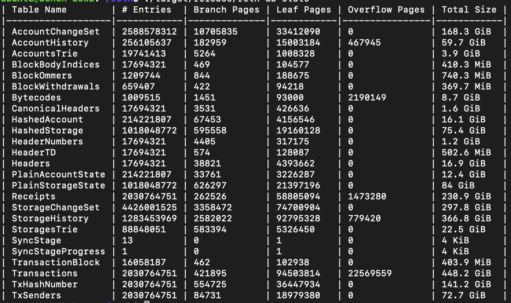

+++
title = "Zombie nodes of Ethereum"
description = "What data the node would need to follow the chain tip? And various types of Ethereum nodes."
date = 2023-07-23T22:20:00+00:00
updated = 2023-07-23T22:20:00+00:00
draft = false
template = "blog/page.html"

[taxonomies]
authors = ["draganrakita"]
+++

Let us begin with a question that made me start this whole blog post:

`What data the node would need to follow the chain tip?`

And subquestion:

`How big of the disk would you need for that data?`

And the name of this node will be the ***Brain*** node (muhaaa)! Joking aside let's dive in:

## Data

To answer the first question you would need
* a plain state for executing new blocks
* Merkle tree to verify state root
* Little bit of history for the last 64blocks that are still not finalized, for block reorganization
* Logs related to validator deposits to feed it to CL (Consensus Layer) node. 

With this data, we would make a lean node and still be able to fully verify incoming blocks and sync with the CL node.

## Disk size

Here is the data on the full archive mainnet node on block #17694321 on 14.07.2023, gained by executing `./reth db stats`:

The sizes of needed data are shown below:
* `96.4gb` Plain state:
    *  `12.4gb` PlainAccountState
    *  `84gb` PlainStorageState
* `118gb` Merkle tree.
    * `16.1gb` HashedAccount table
    * `75.4gb` HashedStorage table
    * `22.6gb` StorageTrie
    * `3.9gb` AccountsTree
* I don't have the history size number for the last N blocks but it is in the range of a few gb. Will put it at 2GB.
* For deposit events I don't have an exact number but for [856k deposit logs](https://etherscan.io/txsBeaconDeposit) it is around a few gigs, let's say it is `2gb``. 

This would make the ***Brain*** node size around **218.4gb** (what? just **220gb**?)

# Then why are current nodes from 700gb to 15tb? 

It is complicated.

If you want to sync your node from the genesis (zero block) you would need to fetch blocks from somewhere and this is currently embedded inside the Ethereum p2p protocol this means most nodes have all past blocks and this increases the size so our first type of zombie nodes is Block Zombie node, but I am going too far, let's go over how do we get from `15tb` to `220gb` and various types of nodes found in present: 

* Type1 ( old archive node): It contains everything that Ethereum has, those nodes are called archive nodes and from Etherscan OpenEthereum and Geth archive are around ***15TB*** for the current tip. This kind of archive node became unusable, they need months to sync and are just big.
* Type2 (Erigon/Reth archive node): Formating state a little bit differently and omitting history Merkle tries (present trie is still there) you shave a lot of data and you get Erigon/Reth type archive node of ***~2tb***.
* Type3 (full node): If you remove ***history state*** from the node you get ***full*** node, this is currently what Geth/Nethermind/Besu defaults to, size goes to ***700gb-1tb***
* Type4 (brain node): If you shave history blocks and receipts you are getting that lean ***Brain*** node of ***200-300gb***.
    * There is even an intermediate between type3 and type4 where only blocks after 11M are saved as this is the time when CL deposit logs start to appear.

Just to note here if all nodes switch to type4 then type2 nodes would need to get blocks from somewhere else as in essence history blocks would be unavailable over p2p. Infrastructure for this is still not being made but some of the Ethereum nodes by default don't save it. When infra gets made I assume in the future the main type of the node would be Type4.

# The Horde

The question that zombie nodes want to solve is why would you need **1/2tb** NVMe SSD when you can get **500gb** and use a public repository for blocks and other data. It seems more logical. You can put your blocks to aws bucket or external disk, or if you need more resources you could clone parts of data to multiple servers, either way, it is more flexible.

This would make running a node more approachable to new people and would allow Providers/Researchers to run better suited types of the zombie node.

Or maybe the user care only for a particular event of a particular contract and want to have the ability to filter it, or maybe you want to run a lot of transactions on the newest state (Researcher use case), or you want to move the history state to a different place (provider use case) as you want to clone it or not want to be exposed to bandwidth expensive transaction broadcast. There are a lot of small use cases like this as every group of users focuses on something different.

Split have already happened with Consensus and Execution clients and imo I think the execution layer side needs to be split even more and this path seems unexplored (at least in the public).

# Zombie types

The brain would be the main driver that does consensus checks and would push state changes to the zombies, zombies would consume brain data by being subscribed to it and would update its internal state.

`Zombies consuming Brains (data) :)`

I am assuming some kind of streaming from the brain to other zombies is needed, so the brain executes blocks that are received from CL and streams new blocks and state changes to subscribed zombies.

The problems here are the same as with CL and EL nodes, syncing and recovery become troublesome and they can get out of sync. For some of the zombie's nodes recovery is possible and data can be requested again, but for others, it is not and we need to execute blocks again to get them. So zombie nodes if they want to recover data need other zombie nodes, and if out of sync some of them would require braind to resend all history outputs of execution.

### Block zombie node

This is the first zombie that I am mentioning, it contains blocks (headers, bodies and receipts) and all of those data are checkable with just a hash.

It will contain multiple things, **~500gb** of blocks, **~200gb** of receipts and around **~200gb** for senders and tx hashes index. If blocks/receipts are available from Brain it will allow Brain to still respond to requests over the p2p network and maintain the same protocol that is presently used. The otherwise empty brain can use those blocks to do initial sync, it should be faster and more reliable.

This node could have slow disks as it just needs to save blocks of data and it becomes a lot easier to cache things as we can perceive blocks as a blob of data that we need to save.

The good thing is there could be one Block node and multiple Brain nodes, this would allow faster fetching of the blocks if the brain needs to initially sync. All brain nodes could push blocks to the Block zombie and the zombie would save them all (or the main chain that gets extended)

### History state zombie node

history state **~900gb** allows you to access the past state of Ethereum. At every block, you would be able to fetch the balance/nonce/code or storage of the account.

The good thing about this is that we can add multiple indexes to the data and even create an index zombie node from it as we could map every change of the account.

if you have a Block zombie node to get transactions you could use it to execute it and get transaction traces. It can be used to inspect past state both of accounts and storage.

### State zombie node

Needed for MEV searchers and block builders that do a lot of simulations on the tip they emulate transactions to find the best block rewards or possible MEV, this is already done by a lot of people/groups in space behind the doors and it should be fun to bring that more to the public.

This node would need just the newest state that is around ***~100gb***

The use case of MEV and builders is different but they operate on the newest state so I just wanted to mention this type of node. Builders for example would need to state root from the Merkle trie but they can delegate that to the Brain node.

### Some Future/Experimental zombie nodes

* Logs Zombie
If you want to prune a lot of logs and save only ones that are of interest to you. Or have a custom indexer for it.
* State proof zombie
With state expire already mentioned [few times](https://notes.ethereum.org/@vbuterin/verkle_and_state_expiry_proposal) and something that is probably going to happen in [future](https://ethereum.org/en/roadmap/statelessness/#:~:text=State%20expiry%3A%20allow%20state%20data,without%20a%20local%20state%20database.) (Hard to tell when) this will be additional type of nodes that would allow transitioning accounts from expired to present state
* Zombie aggregator
Aggregate all streamable data from the brain (or multiple brains) that would allow populating other zombie nodes.

And I assume there will be an even more variant.

# Conclusion

As the Ethereum state grows over time it becomes unusable, we need to mitigate this to slow down the growth until proper mechanisms are in place. Dropping of intermediate history Merkle trie's was the first mitigation that was naturally done and the second wave that we see is the dropping of history blocks.

In the end, presenting this as a zombie/brain/horde way was fun :) but the main ideas behind this post are half educational half exploratory, it is defining the execution node types that we already have (it is just about what data they possess), and that we can get even smaller execution nodes, and exploring the notion that having additional nodes/zombies that bind to execution node can give us different interactions/benefits in the ecosystem as not all data are made equal.